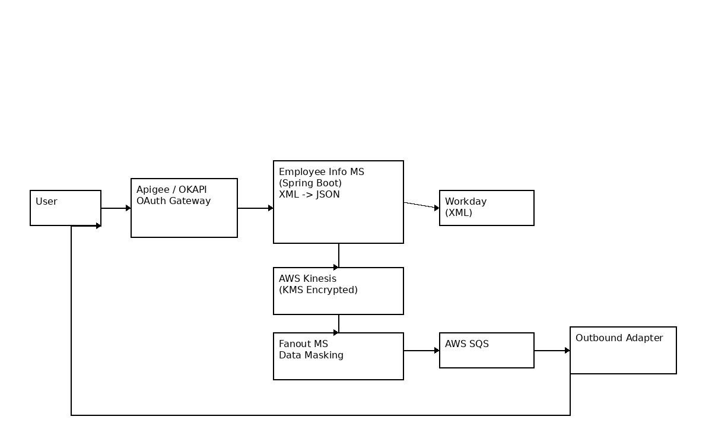

# Employee Information Retrieval System – Workday Integration

## Overview
This project demonstrates a production-grade enterprise microservices architecture developed for the telecommunications domain. The system retrieves employee information from Workday based on user requests and securely delivers masked data according to access classification levels.

Due to organizational confidentiality and NDA restrictions, source code is not included. This repository provides architecture, design, and implementation approach.

---

## Business Objective
- Retrieve employee data using Employee ID
- Provide data in user-required format
- Protect sensitive information through classification-based masking
- Enable secure, real-time, scalable processing

---

## High-Level Architecture

### Key Components

**API Layer**
- Apigee (OKAPI)
- OAuth-based authentication
- Secure API routing

**Core Services**
1. Employee Info Microservice (Spring Boot)
 - Accepts request via Apigee
 - Sends XML request to Workday
 - Receives XML response
 - Converts XML → JSON
 - Retry mechanism (3 attempts)

2. AWS Kinesis
 - Real-time event streaming
 - Encryption using AWS KMS

3. Fanout Microservice
 - Consumes events from Kinesis
 - Identifies data classification:
 - Unrestricted
 - Restricted
 - Confidential
 - Masks sensitive fields

4. AWS SQS
 - Reliable message queue

5. Outbound Adapter Microservice
 - Delivers final response to user

---

## User Flow

User → Apigee (OAuth) → Employee Info MS → Workday 
Workday → XML Response → XML to JSON Conversion 
JSON → Kinesis → Fanout (Masking) → SQS → Outbound Adapter → User

---

## Sequence Diagram

---

## Production Deployment

### Infrastructure
- AWS ECS / EC2 with Auto Scaling
- Secure VPC configuration
- AWS Kinesis & SQS
- AWS KMS encryption
- Monitoring using Splunk and New Relic
- CI/CD using Bamboo
- Agile tracking via JIRA

---

## Key Features

- OAuth authentication via Apigee
- External Workday XML integration
- XML to JSON transformation
- Retry handling for external failures
- Real-time event-driven architecture
- Classification-based data masking
- End-to-end encryption using AWS KMS
- Production monitoring and alerting

---

## Technology Stack

- Java
- Spring Boot
- Gradle
- Apigee (OKAPI)
- AWS Kinesis
- AWS SQS
- AWS KMS
- Postman
- Bamboo
- JIRA
- Splunk
- New Relic

---

## My Role

**Senior Java Developer / Acting Technical Lead**

- Designed core microservice components
- Implemented Workday XML integration
- Developed XML to JSON transformation logic
- Implemented retry and error handling mechanisms
- Developed event publishing to AWS Kinesis
- Guided junior developers and performed code reviews
- Coordinated deployments and production support
- Ensured security and data masking compliance

---

## Challenges & Solutions

**Sensitive Data Protection** 
Implemented classification-based masking and encryption using AWS KMS.

**External System Reliability** 
Handled Workday downtime with retry logic and failure handling.

**Real-Time Processing Requirement** 
Implemented event-driven architecture using AWS Kinesis and SQS.

---

## Future Enhancements

- Circuit breaker pattern
- Caching for frequently requested employees
- Centralized monitoring dashboard
- Rate limiting at API Gateway

---

## Note
This repository contains architecture and design documentation only. Source code is excluded due to confidentiality agreements.

